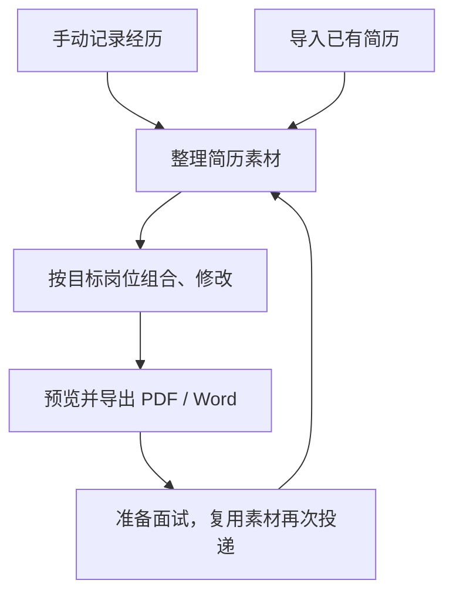

# 求职工作台

面向 Windows 本机运行的简历素材管理与简历生成工具。

当前版本为 **0.1.0-test 公开预览版**，目标环境为 Windows 10/11 64 位和 Microsoft Edge，尚未进行代码签名，不宣称正式稳定版。

从 [官方 Releases 页面](https://github.com/yexu233-prog/career-workbench/releases) 下载 `career-workbench-0.1.0-test.zip` 和同名 `.zip.sha256`。GitHub 自动提供的 Source code 压缩包不是可双击程序。下载 ZIP 后核对 SHA-256，解压到独立目录再启动；详细步骤见 [Windows 使用说明](docs/Windows测试版使用说明.md)。

## 当前可用功能

- **简历素材管理**：手动记录或导入已有简历，沉淀经历素材，面向不同岗位生成多版本素材与面试备注。
- **简历智能生成**：按目标岗位组合素材，手动或借助 AI 优化内容，预览并导出 PDF、Word。

支持纯手动使用；资料保存在本机，提供备份与恢复。AI 功能需自行配置，生成结果由用户确认后采纳。

## 如何使用



可以从最适合自己的一步开始，AI 辅助不是必选步骤。

## 功能图解

通过三张示意图了解主要操作；全部八张图与文字步骤见[完整图解使用指南](docs/图解使用指南.md)。适用 `0.1.0-test`，示例均为虚构；AI 候选图为未连接真实模型的交互演示。图片小字可点击查看原图，具体操作以应用实际页面为准。

### ① 建立可复用素材

从记录经历开始，积累可以反复使用的求职素材。

<a href="docs/images/guide/0.1.0-test/01-建立素材库.png"></a>

[查看①原图](docs/images/guide/0.1.0-test/01-建立素材库.png)

### ④ 组合目标简历

选择岗位版本，组合并独立调整当前简历。

<details>
<summary>查看简历组合示意</summary>

<a href="docs/images/guide/0.1.0-test/04-组合一份目标简历.png"></a>

[查看④原图](docs/images/guide/0.1.0-test/04-组合一份目标简历.png)

</details>

### ⑥ 预览并导出

检查版式与分页，生成文件后选择位置保存。

<details>
<summary>查看预览导出示意</summary>

<a href="docs/images/guide/0.1.0-test/06-预览并导出.png"></a>

[查看⑥原图](docs/images/guide/0.1.0-test/06-预览并导出.png)

</details>

更多操作见[完整图解使用指南](docs/图解使用指南.md)：包括简历导入、岗位版本、可选 AI、个人资料与备份。

## 启动与安全

Windows 用户可双击 `启动求职工作台.cmd` 启动，双击 `停止求职工作台.cmd` 停止。
发布 ZIP 同目录提供 `.zip.sha256`；包内提供 `LICENSE`、`version.json`、`发行说明.md`、`manifest.json` 和 `licenses/`。项目源码采用 MIT，Copyright (c) 2026 叶许；第三方组件保留各自许可证。先核对文件来源和校验值，不要从来源不明的位置运行未签名包，也不要关闭系统安全防护。许可资料见 `docs/许可证核对记录.md`。

业务数据保存在本机；**主动使用 AI 时，所选内容会发送给你配置的服务商，并可能产生费用**。无需 AI 时可以手动完成整理和生成。见 [架构与隐私说明](docs/架构与隐私说明.md)。

## 开发命令

```text
npm ci
npm run dev
npm run check
npm run release:test
```

## 文档

- [图解使用指南](docs/图解使用指南.md)：八张示意图与操作步骤。
- [Windows 使用说明](docs/Windows测试版使用说明.md)：启动、停止、升级与排障。
- [架构与隐私说明](docs/架构与隐私说明.md)：本机数据与 AI 发送范围。
- [许可证核对记录](docs/许可证核对记录.md)：项目与第三方许可。
- [问题反馈](https://github.com/yexu233-prog/career-workbench/issues)（仅使用虚构资料）。
- [贡献与开发说明](CONTRIBUTING.md)；[安全报告说明](SECURITY.md)。

开发需要 Node.js 24。测试使用虚构数据和模拟 AI，无需服务商密钥。公开包使用 `npm run release:public`，要求干净提交及版本对应标签；本机试包可以使用 `npm run release:test`。问题反馈仅使用虚构内容，不上传真实简历、JD、密钥或备份。
