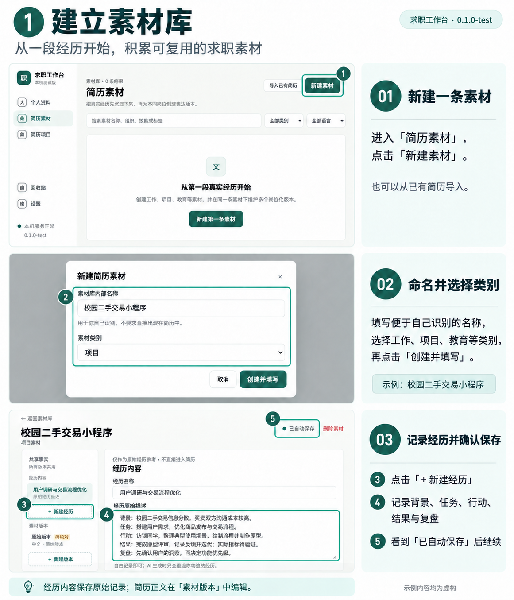
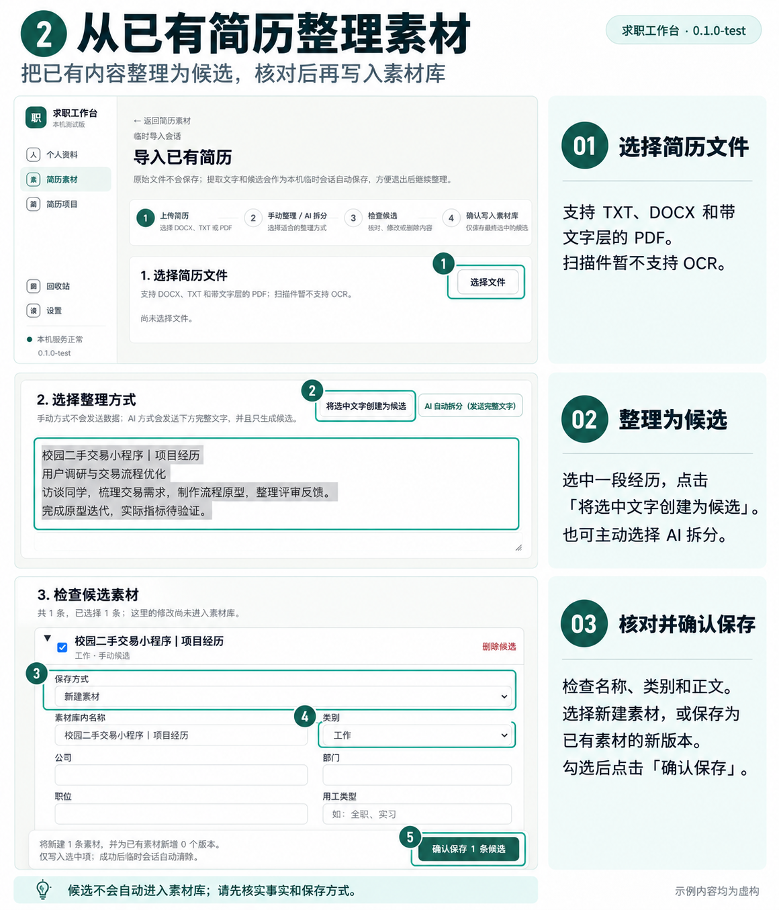
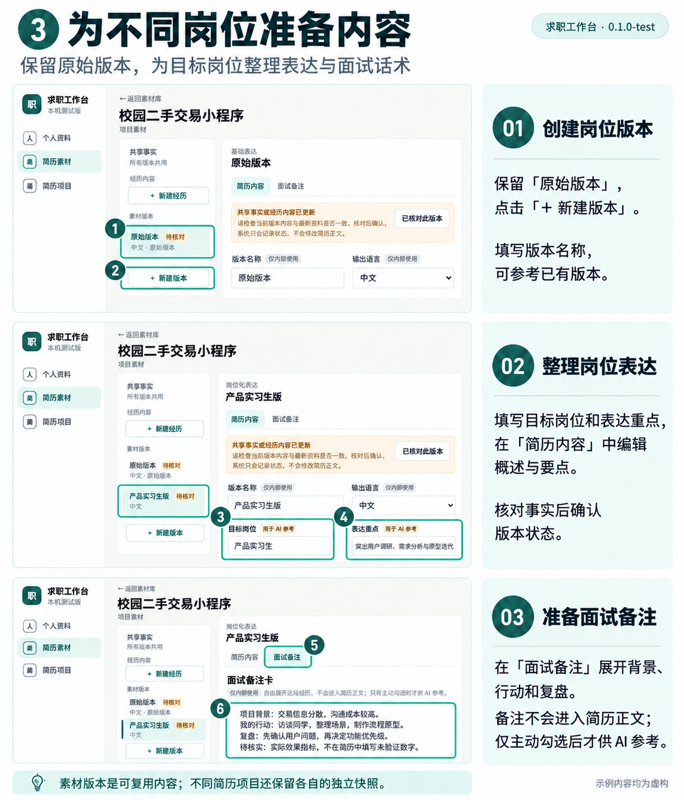
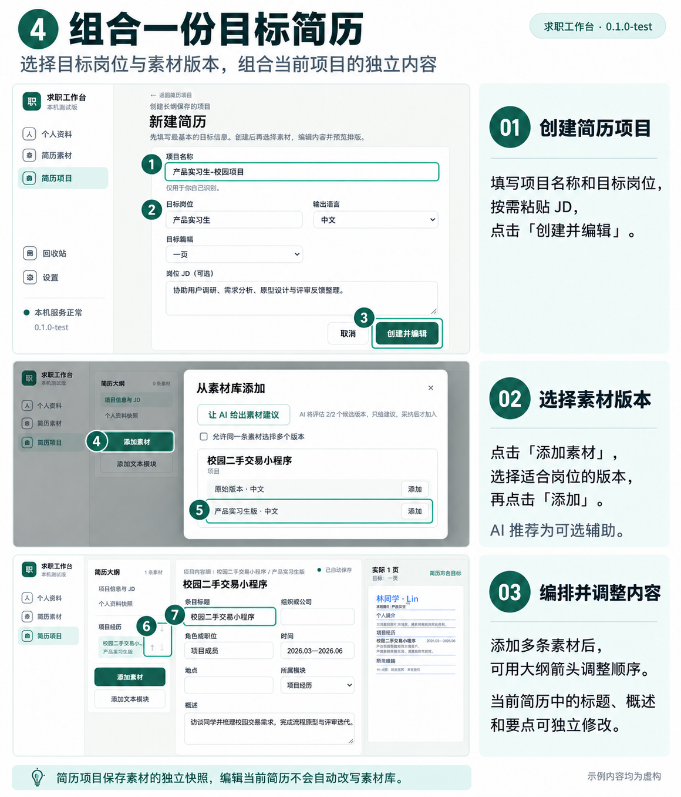
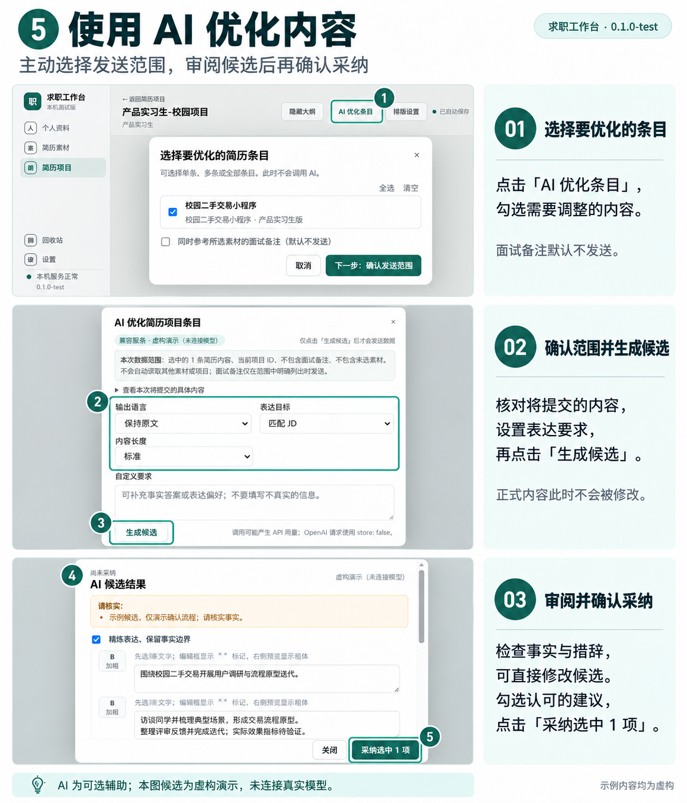
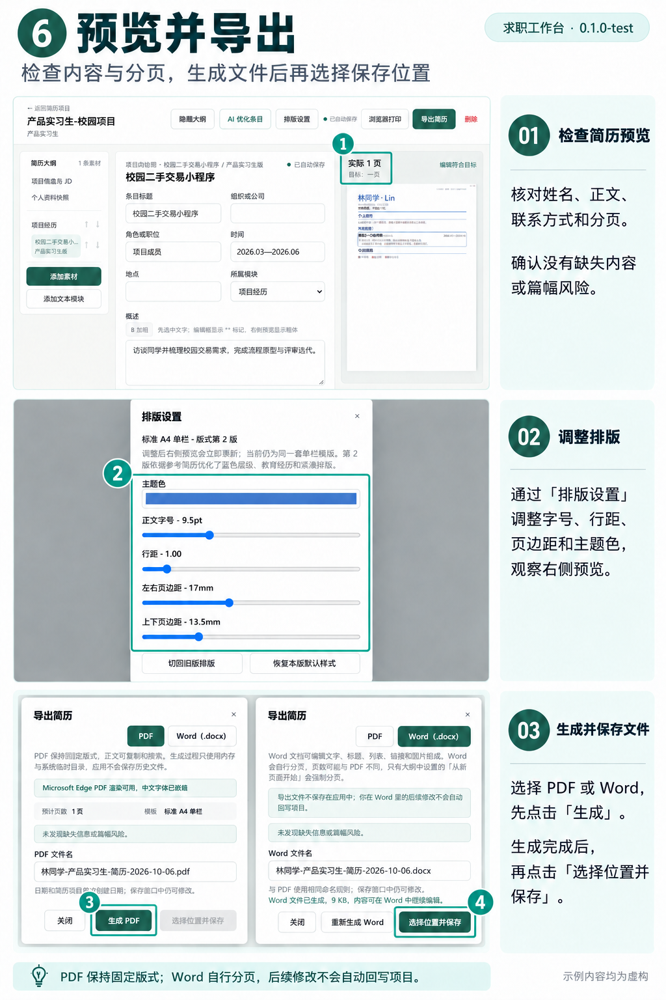
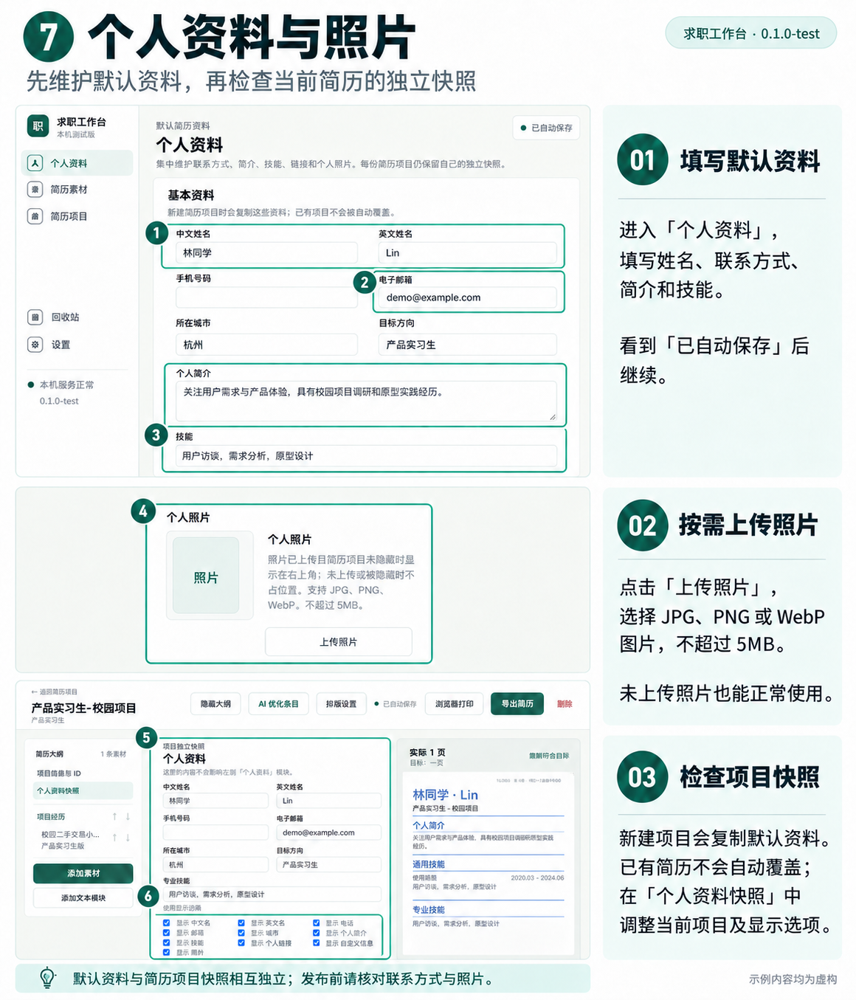
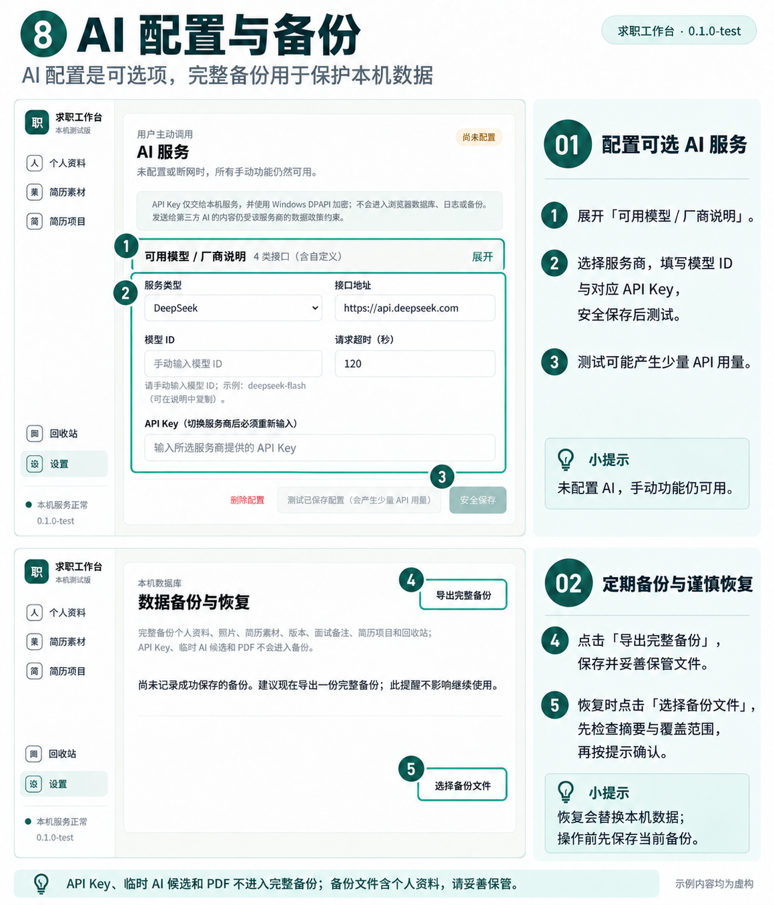

# 求职工作台图解使用指南

适用版本：`0.1.0-test` 公开预览版。图片对应发布包构建提交 `47ebc40407e8abafabe994ae781a583cdf0606b4`。

图中的项目、简历和联系方式均为虚构。⑤中的 AI 候选为**虚构演示（未连接模型）**，仅说明交互流程，不代表任何模型的实际生成效果或测评。图片基于发布版截图制作，不是逐像素界面复刻，具体操作以应用实际页面为准。小字可通过每节的“查看原图”放大；操作步骤也完整写在图片下方。

首次使用建议先填写[⑦个人资料](#guide-07)，再按 **①／② → ③ → ④ → ⑤（可选）→ ⑥** 操作；[⑧配置与备份](#guide-08)按需查看。AI 配置不是手动使用的前提，请定期备份。

## 目录

- [① 建立素材库](#guide-01)
- [② 从已有简历整理素材](#guide-02)
- [③ 为不同岗位准备内容](#guide-03)
- [④ 组合一份目标简历](#guide-04)
- [⑤ 使用 AI 优化内容（可选）](#guide-05)
- [⑥ 预览并导出](#guide-06)
- [⑦ 个人资料与照片](#guide-07)
- [⑧ AI 配置与备份](#guide-08)

## ① 建立素材库

把经历记录下来，形成可复用的求职素材。

[查看①原图](images/guide/0.1.0-test/01-建立素材库.png)

1. 进入「简历素材」，点击「新建素材」，填写内部名称和类别，再点击「创建并填写」。
2. 工作、项目、校园类素材可点击「＋ 新建经历」，填写经历名称，再点击「创建并填写」。
3. 自由记录背景、任务、行动、结果与复盘；看到「已自动保存」后继续。填写示例不要求强制分段。

经历内容是原始记录，不直接进入简历；简历正文在「素材版本」里编辑。内部名称用于自己识别，不等于最终简历的条目标题。

## ② 从已有简历整理素材

把现有简历整理为候选，核对后再保存为正式素材。

[查看②原图](images/guide/0.1.0-test/02-从已有简历整理素材.png)

1. 从素材列表进入「导入已有简历」，选择 TXT、DOCX 或带文字层的 PDF；扫描件暂不支持 OCR。
2. 选中提取文字的一段经历，点击「将选中文字创建为候选」。也可主动选择 AI 拆分，该操作会发送完整提取文字。
3. 核对候选的名称、类别、事实与正文，选择新建素材或保存为同类别已有素材的新版本；后者需选择目标素材并填写版本名称。
4. 勾选要保存的候选，点击「确认保存 1 条候选」或界面显示的对应数量。

**图中默认「工作」类别尚待核对，虚构校园项目应改为「项目」。图中没有展示保存成功。**确认保存前，候选尚未写入正式素材库。原始导入文件不会保存进应用，提取文字和候选可作为本机临时会话保留。

## ③ 为不同岗位准备内容

保留原始版本，为不同岗位整理表达与面试话术。

[查看③原图](images/guide/0.1.0-test/03-为不同岗位准备内容.png)

1. 保留「原始版本」，点击「＋ 新建版本」，填写版本名称，可选择参考已有版本。
2. 在「简历内容」中填写目标岗位、表达重点、概述和要点。目标岗位与表达重点用于 AI 参考，实际正文仍需手动编辑或主动生成。
3. 出现「待核对」时，检查正文与最新事实是否一致，再点击「已核对此版本」。
4. 在「面试备注」展开背景、行动、结果和复盘，为面试准备更完整的讲述。

核对操作只记录状态，不自动修改正文。面试备注不进入简历正文，只有主动选择时才供 AI 参考。

## ④ 组合一份目标简历

选择适合岗位的素材版本，组合并独立调整当前简历。

[查看④原图](images/guide/0.1.0-test/04-组合一份目标简历.png)

1. 进入「简历项目」新建简历，填写项目名称与目标岗位，按需填写 JD，再点击「创建并编辑」。
2. 点击「添加素材」，选择岗位版本后点击「添加」。AI 推荐是可选辅助，不配置 AI 也能手动添加。
3. 添加多个模块或条目后，用大纲箭头调整顺序，并按需修改当前项目的标题、概述与要点。

只有一条素材时，相应排序箭头不可用，这是正常状态。项目保存素材的独立快照，修改当前简历不会自动改写素材库。

## ⑤ 使用 AI 优化内容（可选）

主动选择发送范围，审阅候选后再决定是否采纳。

[查看⑤原图](images/guide/0.1.0-test/05-使用AI优化内容.png)

1. 先在设置中配置 AI。点击「AI 优化条目」，勾选内容，再点击「下一步：确认发送范围」。
2. 核对数据范围与具体提交内容，设置输出语言、表达目标及自定义要求，再主动点击「生成候选」。面试备注默认不发送，需另行主动选择。
3. 检查候选事实和措辞，必要时修改；勾选认可的建议，点击「采纳选中 1 项」或对应数量。

生成候选不会自动修改正式内容，确认采纳才写入当前项目。**本图为「虚构演示（未连接模型）」：没有真实模型请求、API Key 或效果测评。**真实调用会向配置的服务商发送所选内容，并可能产生 API 用量。

## ⑥ 预览并导出

检查版式与分页，生成文件后选择位置保存。

[查看⑥原图](images/guide/0.1.0-test/06-预览并导出.png)

1. 检查右侧预览中的姓名、正文、联系方式、分页与照片（如已上传）。
2. 在「排版设置」调整主题色、字号、行距与页边距，观察预览变化。
3. 点击「导出简历」并选择 PDF 或 Word；先点击「生成 PDF」或「生成 Word」，完成后再点击「选择位置并保存」。未生成时保存按钮不可用。

图中 PDF 是生成前画面，Word 是实际生成完成画面；本批示意图制作不是 PDF 回归验收。PDF 保持固定版式，Word 自行分页，页数可能不同。在 Word 中的后续修改不会回写项目；应用不保存导出历史文件，请自行管理。

## ⑦ 个人资料与照片

先维护默认资料，再检查当前简历的独立资料快照。

[查看⑦原图](images/guide/0.1.0-test/07-个人资料与照片.png)

1. 在「个人资料」填写姓名、联系方式、简介与技能，确认自动保存。
2. 如需照片，点击「上传照片」，选择 JPG、PNG 或 WebP，不超过 5MB。照片可选；本图仅展示入口，没有使用真人照片。
3. 新建项目会复制当时的默认资料；在项目的「个人资料快照」检查当前内容与显示选项。

全局资料修改不会自动覆盖已有项目快照。投递前逐份检查联系方式和照片状态，未上传照片也能正常制作简历。

## ⑧ AI 配置与备份

AI 配置按需进行，完整备份用于保护本机资料；这两项不必连续操作。

[查看⑧原图](images/guide/0.1.0-test/08-AI配置与备份.png)

1. **可选 AI 服务**：展开「可用模型 / 厂商说明」，选择服务商，填写接口地址、模型 ID 与对应 API Key，点击「安全保存」，再测试已保存配置。调用和连接测试可能产生 API 用量。图中 Key 与模型 ID 未填写，也没有连接测试。
2. **导出备份**：点击「导出完整备份」，完成文件保存并妥善保管。若浏览器直接下载，找到文件后再确认已保存。
3. **谨慎恢复**：点击「选择备份文件」，核对摘要、版本和覆盖范围，按提示保存当前数据备份后再确认恢复。

未配置 AI 时手动功能仍可用。模型权限、额度与可用性以服务商账户为准。完整恢复会替换本机业务数据，不是合并导入；不能随意确认。API Key、临时 AI 候选和 PDF 不进入备份，但备份包含个人资料和业务内容，且不是加密档案，请作为私人文件保管。

## 继续阅读

- [返回产品首页](../README.md)
- [Windows 使用说明](Windows测试版使用说明.md)：启动、停止、升级、回退与排障。
- [架构与隐私说明](架构与隐私说明.md)：本机数据和 AI 服务边界。
- [许可证核对记录](许可证核对记录.md)
- [问题反馈](https://github.com/yexu233-prog/career-workbench/issues)：仅提供虚构资料，不上传真实简历、JD、密钥或备份。
- [安全报告说明](../SECURITY.md)；[贡献与开发说明](../CONTRIBUTING.md)。
